# Auditoria do site antigo

Antes de começar o site novo, fiz um levantamento de como o site da clínica estava (07/10/2026). A ideia é ter um "antes" pra comparar depois.

O site antigo é um WordPress 7.1.3 com Elementor 3.29.1, tema Kava e 7 plugins, hospedado na HostGator (Plano M, pago até 09/2029). Os e-mails ficam no Titan, que vem junto com o plano. O domínio está no Registro.br no CNPJ da clínica e vence em 01/12/2026.

## PageSpeed

Rodei o PageSpeed Insights na página inicial:

| | Celular | Computador |
| --- | --- | --- |
| Desempenho | 29 | 50 |
| Acessibilidade | 90 | 90 |
| Práticas recomendadas | 73 | 73 |
| SEO | 92 | 92 |

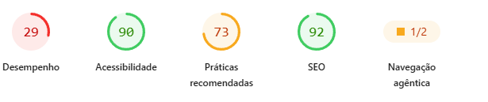
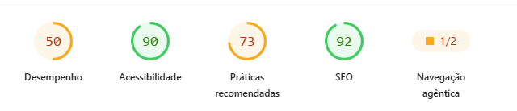

No computador:

- First Contentful Paint: 1,0 s
- Largest Contentful Paint: 6,9 s (a foto grande do topo; o recomendado é até 2,5 s)
- Total Blocking Time: 340 ms
- Speed Index: 5,1 s
- Cumulative Layout Shift: 0,007 (isso tá ok)

O maior problema é o peso. A home baixa uns 11 MB no celular e 15 MB no computador. Quase tudo vem das imagens (PNG grande sem otimizar) e do JavaScript do Elementor e dos plugins.

| | Celular | Computador |
| --- | --- | --- |
| Peso total | 11.195 KiB | 15.501 KiB |
| Dá pra economizar em imagens | 6.503 KiB | 10.567 KiB |
| Dá pra economizar com cache | 9.843 KiB | 13.671 KiB |
| Execução de JavaScript | 6,3 s | 1,7 s |
| Thread principal ocupada | 13,6 s | 3,8 s |
| JavaScript não usado | 633 KiB | 866 KiB |
| CSS não usado | 258 KiB | 257 KiB |
| Bloqueio de renderização | 3.360 ms | 910 ms |

Outras coisas que apareceram:

- não tem meta description
- texto com pouco contraste
- links/ícones sem nome (leitor de tela não sabe o que é)
- botões muito pequenos ou colados no celular
- 4 cookies de terceiros e erros no console
- nenhum header de segurança (CSP, HSTS, X-Frame-Options)
- navegação agêntica 1/2, a árvore de acessibilidade tá mal estruturada

Os prints completos do relatório estão no fim deste arquivo.

## Bugs

- "Sobre Nós" e "Contato" no menu não levam a lugar nenhum
- o link "Contato" do rodapé tem um caractere errado na URL
- o "Saiba Mais" de Bioimpedância (página Estética Corporal) tá sem link
- o e-mail do rodapé tá escrito com acento (`contato@clínicasilhueta.com.br`) e a conta contato@ nem existe no Titan, então quem manda e-mail pra lá não recebe resposta
- tem dois links de WhatsApp diferentes no site: 17 botões usam um link de mensagem pronta e 8 usam o número direto

## Conteúdo

- as páginas "Peeling ac. Retinoico" e "Preenchimento" estão publicadas mas vazias
- erros de digitação: "Microagulahento" na URL, "Microagulalhamento" no título, "Subsição" (é Subcisão), "ProtocoloGanho de Massa" e "ProtocoloStress" sem espaço, "para um vida plena"
- copyright ainda diz 2023
- o blog não tem post novo desde outubro de 2023 (são 3 no total)
- tem um widget de vídeo na home com o que parece ser o vídeo de exemplo do Elementor
- a maior parte do texto dos serviços tá escrita dentro das imagens, então o Google e leitor de tela não leem

## Segurança e manutenção

- não tem nenhum backup automático na hospedagem (fiz um backup manual dos arquivos e do banco antes de mexer em qualquer coisa)
- plugins sem atualização automática, o Elementor tá mais de um ano atrasado
- ninguém estava cuidando do site
- o contato técnico do domínio no Registro.br é de alguém que não mexe mais no site

## LGPD

A política de privacidade é um modelo pronto da internet. Fala de Google AdSense e anúncios, que a clínica não usa, e não fala nada de LGPD nem de dados de saúde.

## Imagens

Tem 76 imagens no WordPress e 39 não são usadas em lugar nenhum. As que são usadas são PNGs de 1024×1024 ou maiores.

## Prints do PageSpeed

### Celular

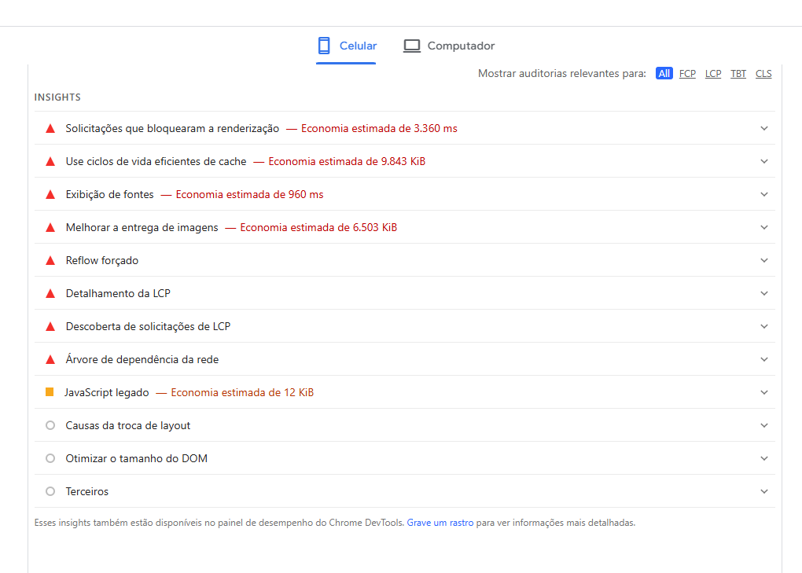
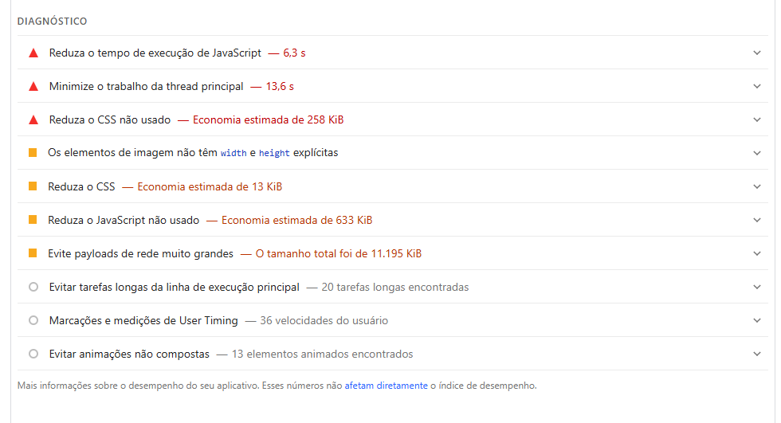
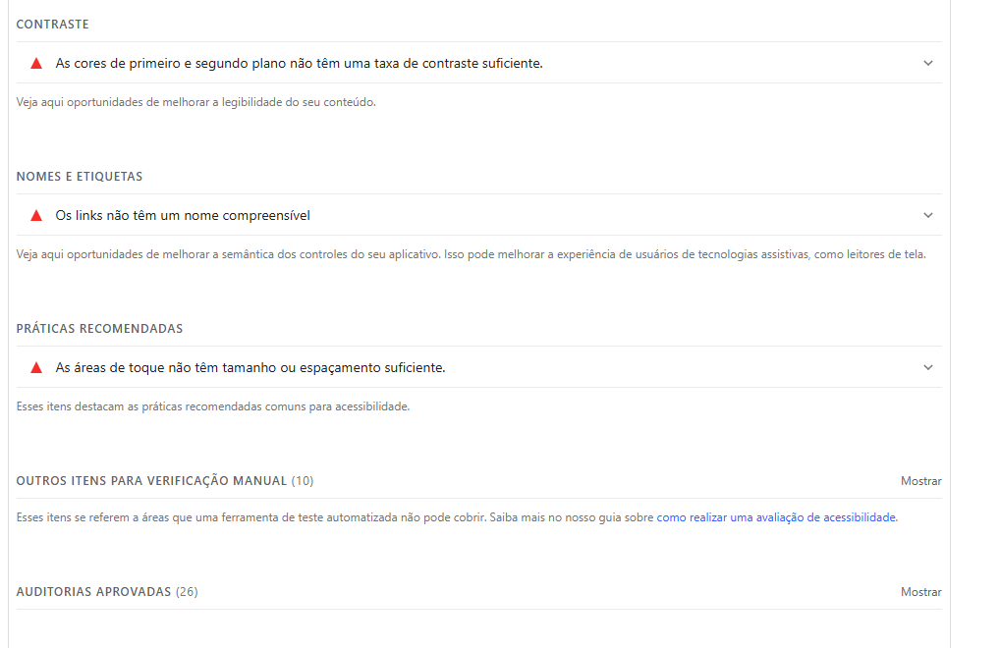
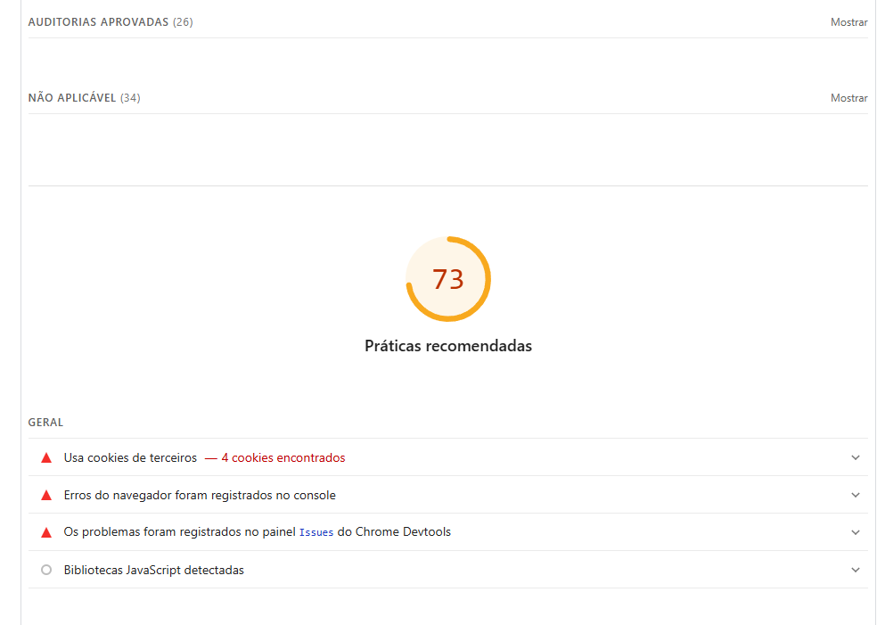
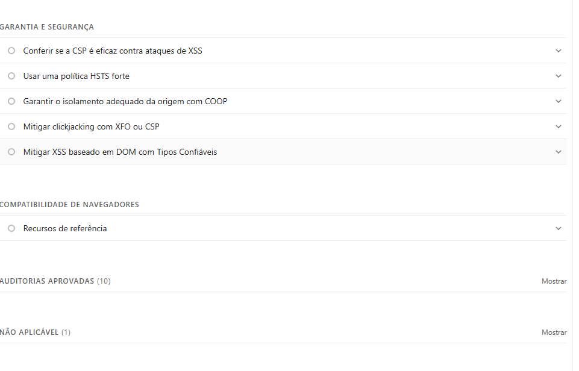
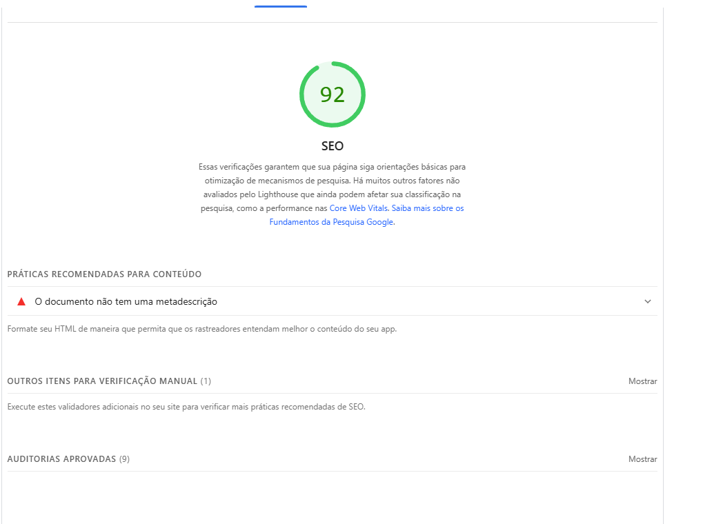

### Computador

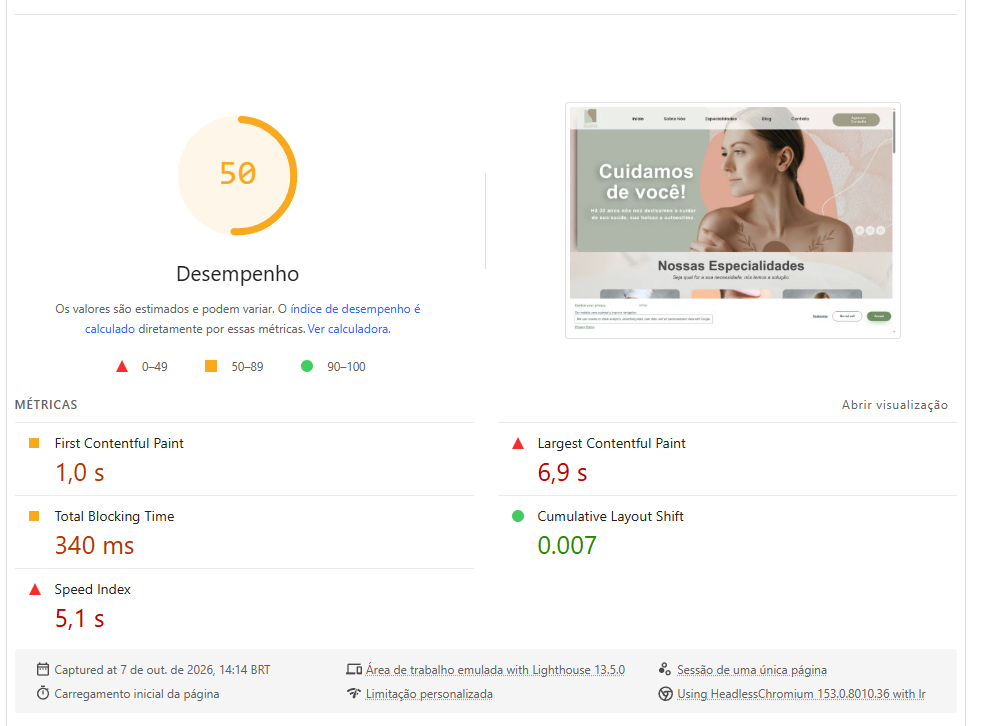
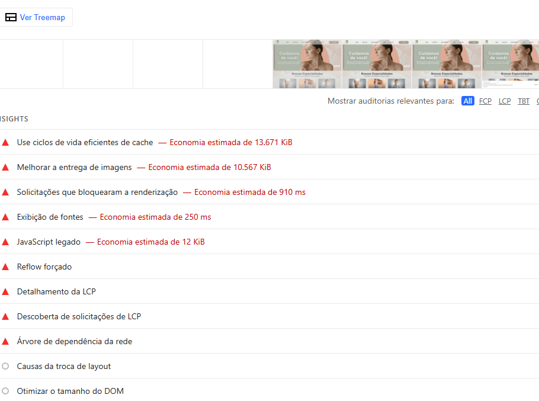
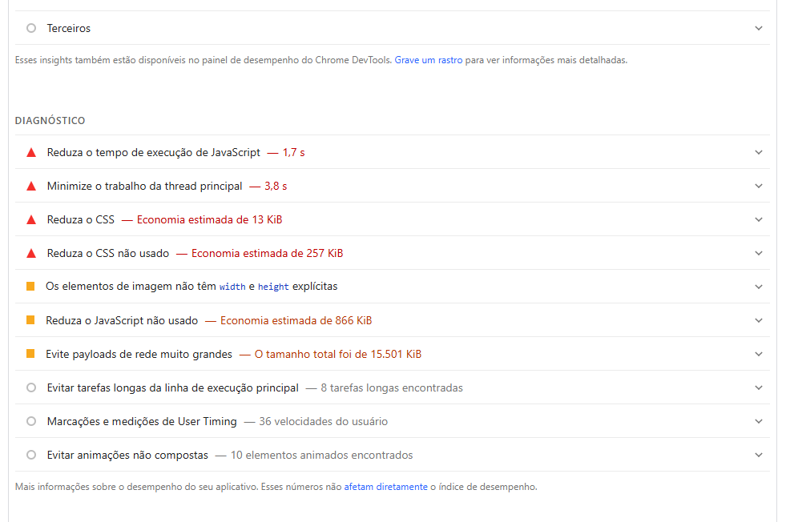
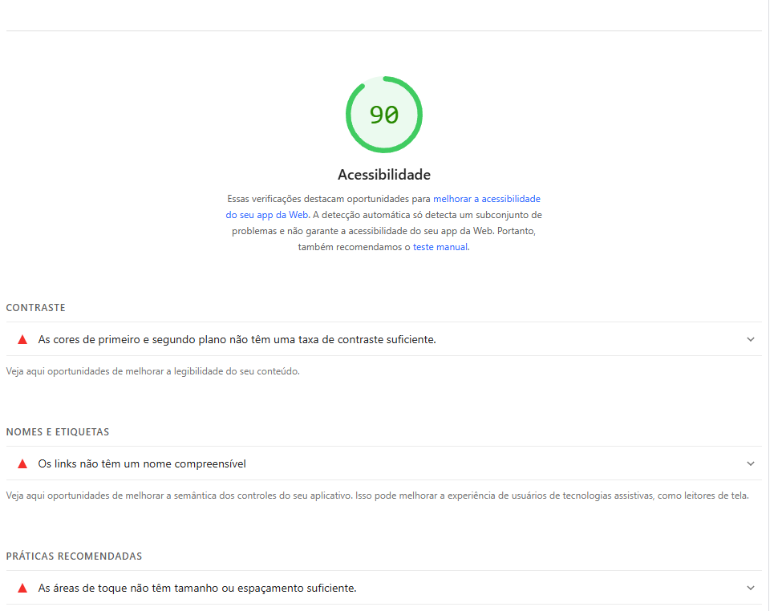
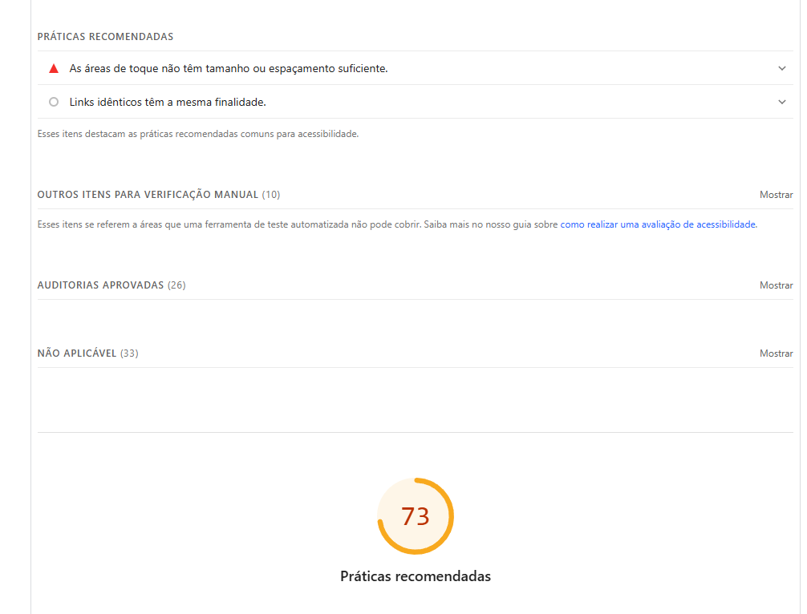
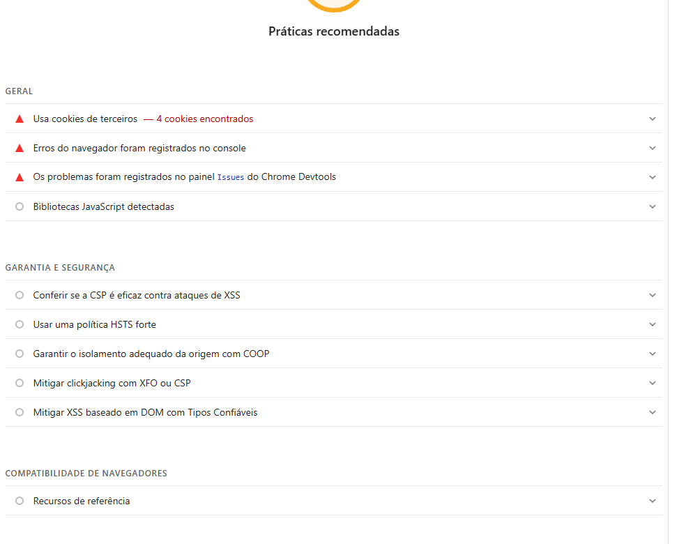
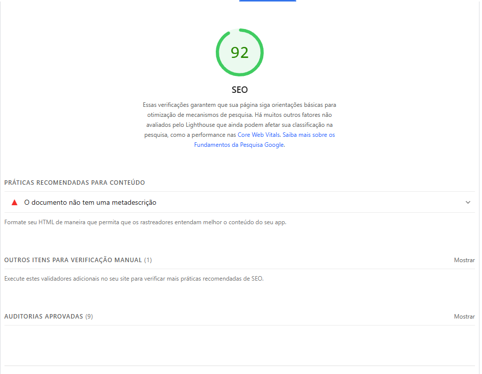
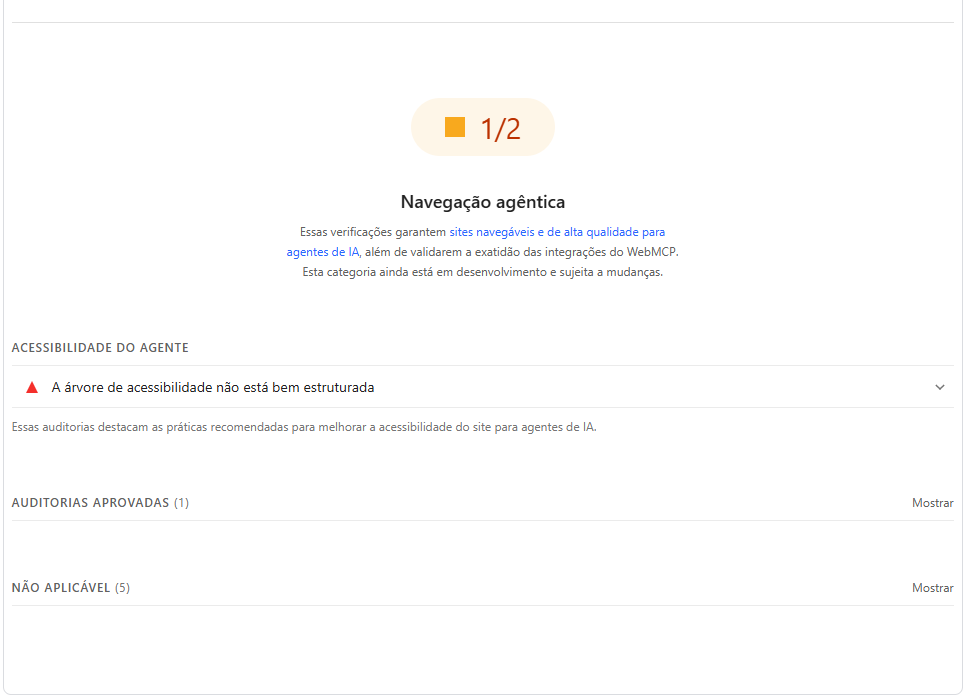
